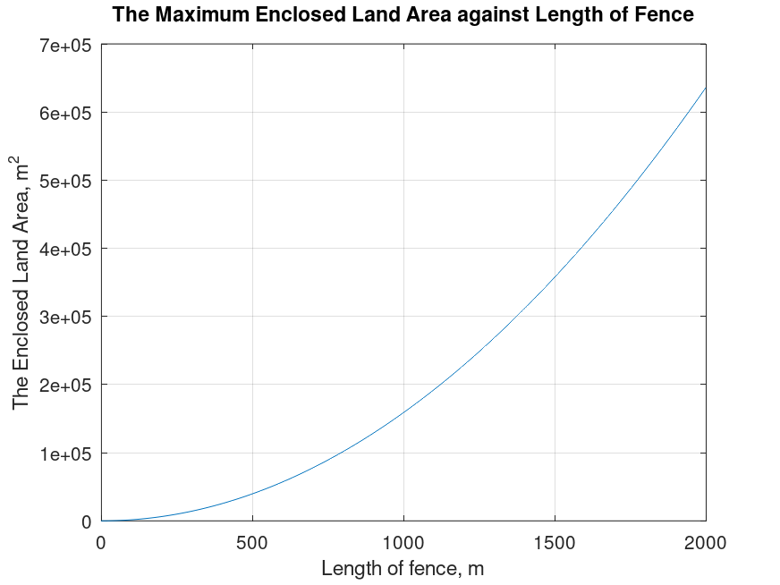

# Maximizing-Enclosed-Land-Area-for-Zoo-Animal-Enclosure-Design
This project focuses on designing a temporary animal enclosure in a zoo with the goal of maximizing the enclosed area using a fixed length of barrier. The proposed design consists of a semicircular section with a radius, 𝑟 connected to a rectangular section with a length ℎ and no width, as illustrated in [[Figure 1](#figure1)]. Together, these shapes form an enclosed area surrounded by a barrier of limited length.

---
<a name="figure1"></a> 

The enclosure is intended for animals that thrive in open, naturalistic environments, but the available barrier length is restricted to 1000 meters. As a result, this project aims to determine the optimal dimensions of 𝑟 and ℎ that maximize the enclosed area while adhering to the barrier length constraint.

Below is the table of contents for navigating the repository.


## Table of Contents
| File                                                   | Function                                               |
|--------------------------------------------------------|--------------------------------------------------------|
| [How to Run](README.md#how-to-run)                     | Instructions to execute the program                    |
| [Methodology](README.md#methodology)                   | Methodology of the project                             |
| [Results and Discussion](README.md#results-and-discussion)| The findings of the project explained               |
| [Conclusion](README.md#conclusion)                     | Conclusion of the project                              |
| [Source Code](Code.m)                                  | Program written in Octave                              |
| [Program Workflow](Program_Workflow/)                  | Flowchart showing the program’s logic                  |


## How to Run

1. **Install MATLAB or Octave**:
   - Ensure you have MATLAB installed on your system. If not, you can use GNU Octave, a free alternative compatible with MATLAB scripts.

2. **Download the Code**:
   - Clone this repository using the command:
     ```
     git clone https://github.com/your-repo/Maximizing-Enclosed-Land-Area.git
     ```
     Alternatively, download the source files directly as a ZIP and extract them.

3. **Open the Code**:
   - Launch MATLAB or Octave.
   - Navigate to the directory containing the downloaded files.

4. **Run the Script**:
   - Open the main script file (e.g., EnclosureDesign.m).
   - In the MATLAB or Octave editor, press F5 or click the Run button to execute the script.

5. **View Graphical Results**:
   - The script will generate multiple plots showing the relationship between the dimensions of the enclosure and the enclosed land area.
   - Each figure corresponds to a specific analysis (e.g., varying 𝑟, ℎ, or barrier length).

6. **Optional Modifications**:
   - Modify parameters such as 𝑟, ℎ, or barrier length directly in the script to explore different configurations.

## Methodology
The optimization process is done by using the octave software. To determine the best 
combinations of 𝑟 and ℎ, the value of 𝑟 is first fixed at a constant value. The enclosed land 
area is then computed and plotted against a range of values of h. The reverse is also carried 
out, where the enclosed land area is plotted against a range of values of 𝑟 using fixed values 
of ℎ. Different values of ℎ are used in the plot to determine the dependency of h on 𝑟 and also 
on the enclosed land area. 

A 3-dimensional surface plot is constructed from three variables, ℎ, 𝑟 and enclosed land area 
on separate axis. The independent variables, ℎ and r are plotted on the horizontal axis while 
the dependent area is plotted on the vertical axis. This is to display the functional relationship 
between each independent variables, ℎ and 𝑟 with the designated dependent variable, the 
enclosed land area. The optimum combination between two sets of data, ℎ and 𝑟 can also be 
determined. A contour plot is also used to display a series of lines of constant land area. 
Besides showing the change of enclosed land area as a function of ℎ and 𝑟, this plot also 
shows the impact of each dimension, h and 𝑟 on the enclosed land area.

Lastly, the enclosed land area is plotted against the dimension 𝑟 by fixing the value of the 
length of the fence. Since the length limits the value of 𝑟 and ℎ, this graph is used to show the 
effect of increasing one dimension, r while decreasing the other, ℎ on the enclosed land area. 
The program is also written to display the value of the maximum enclosed land area and the 
dimension ℎ and 𝑟 that correspond to the maximum enclosed land area, which determines the 
optimum dimensions for the fence. Additionally, the enclosed land area is plotted against the 
length of the fence to determine the contribution of the length of the fence on the enclosed 
land area.


## Results and Discussion

To determine the relationship between ℎ, 𝑟 and the enclosed land area, a graph of enclosed 
land area against ℎ with a fixed value of 𝑟 is plotted as shown in [[Graph 1](#graph1)].

<a name="graph1"></a> 

It can be seen that 
the enclosed land area increases linearly as ℎ increases. On the other hand, the enclosed land 
area increases exponentially as 𝑟 increases, as shown in [[Graph 2](#graph2)].

<a name="graph2"></a> 

This shows that the increase in dimension 𝑟 has higher significance than the increase in h in increasing the enclosed area of 
the land. [[Graph 2](#graph2)] also shows the effect of increasing ℎ on the enclosed land area. This shows 
that the two dimensions, ℎ and 𝑟 are independent from each other but dependent on the 
enclosed land area. If the dimensions 𝑟 and ℎ are not limited by other factors, maximizing 
both dimensions will lead to maximum enclosed land area. However, if the dimension 𝑟 is 
fixed, the maximum value of dimension h should be selected for maximum enclosed land 
area. The opposite is also true, where the selection of the maximum value of 𝑟 is required for 
a fixed ℎ.

The functional relationship between the dimensions ℎ and 𝑟 the enclosed land area can be 
seen in the surface plot of [[Graph 3](#graph3)].

<a name="graph3"></a> 

From the graph, it can be observed that the higher values 
of the enclosed land area are around the higher values of both ℎ and 𝑟, peaking at the highest 
value of both 𝑟 and ℎ. When the dimension 𝑟 is zero, the enclosed land area remains zero 
regardless of the value of ℎ. This is due to the shape of the enclosed land area, where zero 𝑟 
value equals zero width, causing the value of area to be zero. If a range of values of 𝑟 and ℎ 
are available, the selection of the highest values for both these dimensions results in the 
highest maximum land area. The surface plot once again shows that the effect of dimension 𝑟 
on the enclosed land area is more dominant than ℎ. 

The same observation can be made on the contour plot in [[Graph 4](#graph4)].

<a name="graph4"></a> 

The contour plot proves 
that the same enclosed land area can be achieved using different combinations of values for 𝑟 
and ℎ. The series of lines of constant land area shows that the same area obtained using 
higher values of ℎ can be achieved by using lower values of 𝑟. Hence, it can be concluded 
here that to maximize the enclosed land area, the increase in dimension 𝑟 should be prioritized 
over ℎ if both dimensions are limited by other factors.

In this case, the limiting factor of the dimensions is the length of the fence, which is also the 
result of different combinations of 𝑟 and ℎ, since it forms the perimeter resulting from these 
dimensions. Depending on the available resource, the fence may be limited to a certain 
length. As such, the graph of the enclosed land area against the dimension 𝑟 is plotted with a 
fixed value of length of the fence as shown in [[Graph 5](#graph5)].

<a name="graph5"></a> 

The line graph is linear and increasing 
initially but eventually concave downwards while still increasing. Overall, the enclosed land 
area increases as 𝑟 increases. When the length is fixed, if the value of 𝑟 increases, the value of 
ℎ will decrease. If the enclosed land area is to be plotted against the dimension ℎ, it would 
show the reverse, where the enclosed land area will decrease as the dimension ℎ increase.

Furthermore, the dimensions of 𝑟 and ℎ corresponding to the maximum land area is 318.31m 
and 1.3538 x 10−4m respectively. The value of 𝑟 is the maximum value of 𝑟 when the length 
of the fence is fixed at 1000m. By manual calculation, the actual values of 𝑟 and ℎ are found 
to be 318.3098862m and 0m respectively. The error between the actual values and the 
calculated values are due to precision errors that occurred due to limitations of the 
programmer’s code. However, it can still be concluded that the maximum enclosed land area 
occurs at the maximum value of 𝑟, which is also at the minimum value of ℎ. Therefore, to 
minimize the length of the fence while maximizing the enclosed land area, the dimension 𝑟 
should be increased to the maximum while the dimension ℎ should be decreased to the 
minimum. The same can also be said if the length of the fence is limited to a specific value. It 
is proven that the shape of the semicircle has a larger area to perimeter ratio compared to the 
rectangle.  

In addition, to determine the impact of the length of the fence on the enclosed land area, the 
maximum enclosed land area is plotted against the length of the fence in [[Graph 6](#graph6)].

<a name="graph6"></a> 


From the 
graph, the maximum enclosed land area increases exponentially as the length of the fence 
increases. When 𝑟 increases, the perimeter of the shape increases more drastically compared 
to the increase in ℎ. Thus, the enclosed land area will increase exponentially as 𝑟 increases as 
shown earlier, since the maximum enclosed land area is contributed by the maximum value 
of 𝑟. To maximize the enclosed land area, the length of the fence needs to be maximized, 
which requires the increase of the dimension ℎ or 𝑟 or both consequently. 


## Conclusion
In conclusion, to maximize the enclosed land area, the dimension 𝑟 needs to be maximized 
while dimension ℎ needs to be minimized. This is due to a larger area to perimeter ratio for 
the shape of the semicircle with radius r compared to rectangle with length of ℎ. 
Alternatively, it can also be said that the length of the fence is the main factor contributing to 
the enclosed land area. The longer the fence, the larger the enclosed land area. If not limited 
by other factors, the fence should be built with a semicircle shape to maximize the enclosed 
land area. However, if the geometry of the rectangle is required, the increase in dimension 𝑟 
should be prioritized over dimension ℎ to achieve maximum enclosed land area. This is also 
true if the length of the fence is limited to a certain value only.  
