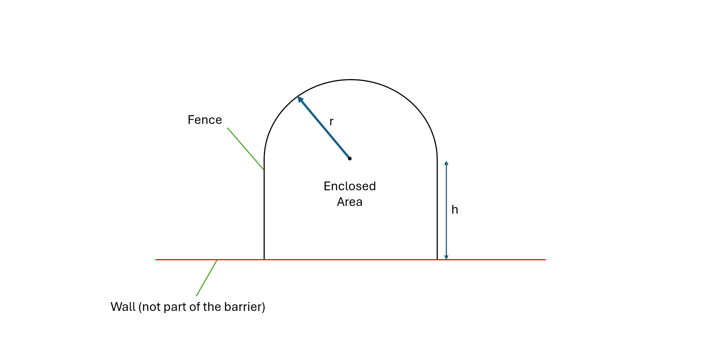

# Maximizing-Enclosed-Land-Area-for-Zoo-Animal-Enclosure-Design
This project focuses on designing a temporary animal enclosure in a zoo with the goal of maximizing the enclosed area using a fixed length of barrier. The proposed design consists of a semicircular section with a radius, 𝑟 connected to a rectangular section with a length ℎ and no width, as illustrated in [Figure 1]. Together, these shapes form an enclosed area surrounded by a barrier of limited length.

The enclosure is intended for animals that thrive in open, naturalistic environments, but the available barrier length is restricted to 1000 meters. As a result, this project aims to determine the optimal dimensions of 𝑟 and ℎ that maximize the enclosed area while adhering to the barrier length constraint.

---
 

Below is the table of contents for navigating the repository.

## Table of Contents
| File                                                   | Function                                               |
|--------------------------------------------------------|--------------------------------------------------------|
| [How to Run](README.md#how-to-run)                     | Instructions to execute the program                    |
| [Detailed Explanation](README.md#detailed-explanation) | Detailed explanation of the program                    |
| [Theoretical Aspects](README.md#theoretical-aspects)   | Explains the theoretical framework and formulas        |
| [Sample Runs](Sample_Runs.png)                         | Screenshots of sample program outputs                  |
| [Handwritten Solutions](docs/)                         | Step-by-step solutions to a sample problem             |
| [Source Code](Code.m)                                  | Program written in Octave                              |
| [Program Workflow](Program_Workflow.png)               | Flowchart showing the program’s logic                  |
| [Input Window Screenshot](input_window.png)            | Example of the program’s input interface               |
| [Output Window Screenshot](output_window.png)          | Sample output generated by the program                 |
